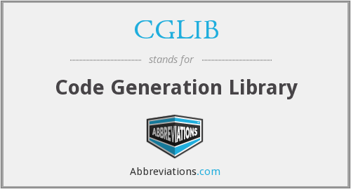

= 创建代理（二）：CGLIB

https://www.diguage.com/post/spring-aop-bootstrap/[Spring AOP 源码分析：入门] 中，梳理出来了 Spring AOP 的入口。 https://www.diguage.com/post/spring-aop-get-advices/[Spring AOP 源码分析：获得通知] 中着重介绍了如何获取通知。上一篇文章 https://www.diguage.com/post/spring-aop-create-proxy-jdk/[Spring AOP 源码分析：创建代理（一）] 重点介绍了一下切面链的组装和基于 JDK 动态代理的 AOP 的实现，这篇文章介绍一下基于 cglib 的代理类是生成。

== CGLIB 简介

CGLIB（Code Generator Library）是一个高性能的代码生成库，被广泛应用于 AOP 框架（Spring）中以提供方法拦截功能，主要以继承目标类的方式来进行拦截实现，因此 CGLIB 可以对无接口的类进行代理。

CGLIB代理主要通过操作字节码的方式为对象引入方法调用时访问操作，底层使用了ASM来操作字节码生成新的类，ASM是一个短小精悍的字节码操作框架。CGLIB的应用栈如下：

image::images/cglib-architecture.jpg[alt="CGLIB",{image_attr}]

****
最新版的 Hibernate 已经把字节码库从 cglib 切换为 Byte Buddy。
****

JDK 动态代理是通过实现 `InvocationHandler` 接口，在其 `invoke` 方法中添加切面逻辑。而 cglib 则是通过实现 `MethodInterceptor` 接口，在其 `invoke` 方法中添加切面逻辑。

下面看一下在 Spring 中，是如何实现利用 cglib 来实现 AOP 编程的？

== `CglibAopProxy`

先看一下创建代理对象的方法：

.`CglibAopProxy#getProxy(ClassLoader)`
[{java_src_attr}]
----
include::{aop_src_dir}/framework/CglibAopProxy.java[tag=getProxy-ClassLoader]
----

这里的关键是创建 `Callback` 数组，这里封装着切面逻辑。

.`CglibAopProxy#getCallbacks`
[{java_src_attr}]
----
include::{aop_src_dir}/framework/CglibAopProxy.java[tag=getCallbacks]
----

CGLIB 是通过 `MethodInterceptor` 来实现方法的拦截和增强的。所以，`CglibAopProxy` 实现的 AOP 的增强都被封装在了 `CglibAopProxy.DynamicAdvisedInterceptor` 类的 `intercept` 中。

.`CglibAopProxy.DynamicAdvisedInterceptor`
[{java_src_attr}]
----
include::{aop_src_dir}/framework/CglibAopProxy.java[tag=DynamicAdvisedInterceptor]
----

还是熟悉的配方，还是熟悉的味道，又看到了 `this.advised.getInterceptorsAndDynamicInterceptionAdvice(method, targetClass)` 了。

无论是 `JdkDynamicAopProxy`，还是 `CglibAopProxy`，它们也只是做了基本处理，而真正对 Advice(通知/增强) 的链式调用都是通过 `AdvisedSupport#getInterceptorsAndDynamicInterceptionAdvice` 最终委托给了 `DefaultAdvisorChainFactory#getInterceptorsAndDynamicInterceptionAdvice` 方法来生成 Advice(通知/增强)链，然后通过 `ReflectiveMethodInvocation` 及其子类来调用到 Advice(通知/增强)链。

在 `JdkDynamicAopProxy` 的 `invoke` 方法中，通过创建 `ReflectiveMethodInvocation` 对象，调用其 `proceed()` 方法，来完成增强的链式调用。

在 `CglibAopProxy` 的 `intercept` 方法中，通过创建 `CglibMethodInvocation` 对象，调用其 `proceed()` 方法，来完成增强的链式调用。 `CglibMethodInvocation` 继承了 `ReflectiveMethodInvocation`。其实， `CglibMethodInvocation` 也是通过调用父类方法完成 AOP 切面调用的。这里就不再贴代码赘述了。

== 总结

最后，使用前面文章提到的“Aspect 应用流程”再来总结一下 Spring AOP 的调用过程：

== 参考资料

. https://zhuanlan.zhihu.com/p/63272694[CGLib 动态代理 原理解析 - 知乎^]
. https://mp.weixin.qq.com/s/L8Ky_d257KRmle2lQ8A0RQ[深入理解Spring框架之AOP实现原理^]

