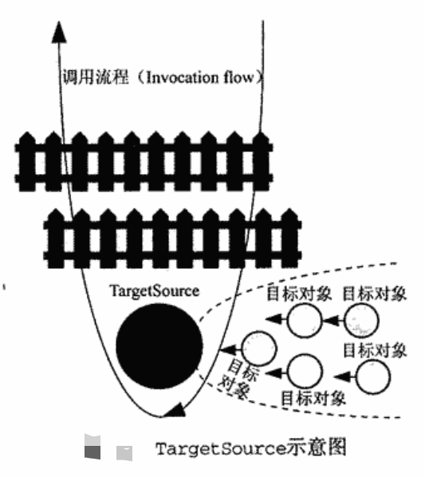
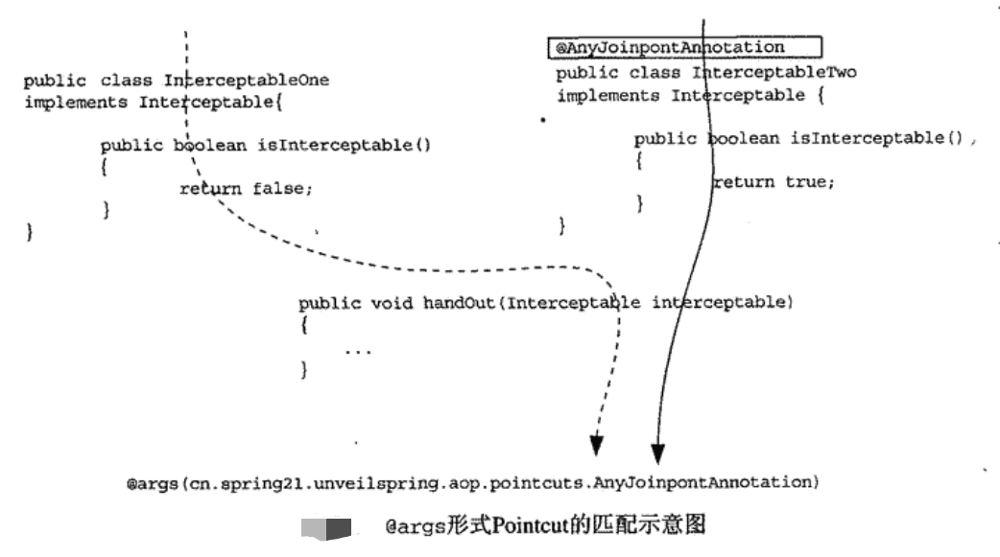
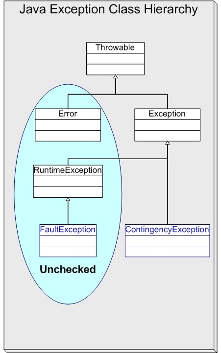

[#aop]
= AOP

include::{includedir}/_attributes.adoc[]

[{java_src_attr}]
----
include::{aop_src_dir}/Advisor.java[]
----

include::{includedir}/aop-process-overview.adoc[leveloffset=+1]

include::{includedir}/aop-bootstrap.adoc[leveloffset=+1]

include::{includedir}/aop-get-advices.adoc[leveloffset=+1]

include::{includedir}/aop-create-proxy-jdk.adoc[leveloffset=+1]

include::{includedir}/aop-create-proxy-cglib.adoc[leveloffset=+1]

plantuml::{includedir}/puml/org.springframework.aop.MethodMatcher.puml[{diagram_attr}]

== `PointcutAdvisor`

plantuml::{includedir}/puml/org.springframework.aop.PointcutAdvisor.puml[{diagram_attr}]

`org.springframework.aop.PointcutAdvisor` 才是真正的定义一个 `Pointcut` 和一个 `Advice` 的 `Advisor`。

`DefaultPointcutAdvisor` 是最通用的 `PointcutAdvisor` 实现。

`NameMatchMethodPointcutAdvisor` 是细化后的 `DefaultPointcutAdvisor`。

`IntroductionAdvisor` 与 `PointcutAdvisor` 最本质的区别是 `IntroductionAdvisor` 只能应用于类级别的拦截，只能使用 Introduction 型的 `Advisor`。

`Ordered` 接口用于指定 Bean 的优先级。数字越小，优先级越高。

== Spring AOP 的织入

`ProxyFactory` 是最基本的一个织入器实现。 `ProxyFactory` 只需要指定如下两个最基本的东西：

. 对其要进行织入的目标对象。
. 将要应用到目标对象的 Aspect。在 Spring 里面叫做 Advisor。

[{java_src_attr}]
----
include::{truman_src_dir}/aop/ProxyFactoryTest.java[]
----

Spring AOP 框架使用 `AopProxy` 对使用的不同的代理实现机制进行了适度的抽象，针对不同的代理实现机制提供相应的 `AopProxy` 子类实现。目前提供了针对 JDK 的动态代理和 CGLIB 字节码增强两种机制的 `AopProxy` 实现。

plantuml::{includedir}/puml/AopProxy.puml[{diagram_attr}]

不同 `AopProxy` 实现的实例化过程采用工厂模式（确切地说是抽象工厂模式）进行封装，即通过 `org.springframework.aop.framework.AopProxyFactory` 创建 `AopProxy` 实例。

`AdvisedSupport` 就是一个生成代理对象所需要的信息的载体。

plantuml::{includedir}/puml/ProxyFactory.puml[{diagram_attr}]

`ProxyFactory` 集 `AopProxy` 和 `AdvisedSupport` 于一身，可以通过 `ProxyFactory` 设置生成代理对象所需要的相关信息，也可以通过 `ProxyFactory` 取得最终生成的代理对象。前者是 `AdvisedSupport` 的职责，后者是 `AopProxy` 的职责。

`ProxyFactory` 只是 Spring AOP 中最基本的织入器实现，还有其他的几个 "兄弟"：

plantuml::{includedir}/puml/ProxyCreatorSupport.puml[{diagram_attr}]

Spring AOP 的自动代理的实现建立在 IoC 容器的 `BeanPostProcessor` 概念之上。只要提供一个 `BeanPostProcessor`，当对象实例化的时候，为其生成代理对象返回，而不是实例化后的目标对象本身，从而达到代理对象自动生成的目的。伪代码如下：

[{java_src_attr}]
----
for (bean in container) {
    if (检查当前 bean 定义是否符合拦截条件；如果符合拦截条件，则) {
        Object proxy = createProxyFor(bean);
        return proxy;
    } 否则 {
        Object instance = createInstance(bean);
        return instance;
    }
}
----

检查当前 bean 是否符合拦截条件，首先需要知道拦截条件是什么？我们通过某种方式，告知自动代理实现类都有哪些拦截条件：

. 通过外部配置文件传入；
. 在具体类的元数据来指明。

`BeanNameAutoProxyCreator` 通过指定一组容器内的目标对象对应的 `beanNames`，将指定的一组拦截器应用到这些目标对象之上。

将 `DefaultAdvisorAutoProxyCreator` 注册到容器后，它会自动搜寻容器内的所有 `Advisor`，然后根据各个 `Advisor` 所提供的拦截信息，为符合条件的容器中的目标对象生成相应的代理对象。为了避免将不必要的横切逻辑织入到不需要的目标对象之上，应该尽量细化各个 `Advisor` 的定义。

`InstantiationAwareBeanPostProcessor` 有 "短路" 功能。

== `TargetSource`

`TargetSource` 的作用就好像是为目标对象在外面加了一个壳，或者说，它就像是目标对象的容器。当每个针对目标对象的方法调用经历层层拦截而到达调用链的终点的时候，就该调用目标对象上定义的方法了。但这时，Spring AOP 做了点儿手脚，它不是直接调用这个目标对象上的方法，而是通过“插足于”调用链与实际目标对象之间的某个 `TargetSource` 来取得具体目标对象，然后再调用从 `TargetSource` 中取得的目标对象上的相应方法。

`TargetSource` 最主要的特性是，每次方法调用都会触发 `TargetSource` 的 `getTarget()` 方法， `getTarget()` 方法将从相应的 `TargetSource` 实现类中取得具体的目标对象，这样就可以控制每次方法调用作用到的具体实例对象：①从目标对象池获取对象；②按照某种规则，选择返回被选中的目标对象实例。

`SingletonTargetSource` 内部只持有一个目标对象，每次调用时，都会返回这同一个目标对象。

`PrototypeTargetSource` 每次调用目标对象上的方法时，都会返回一个新的目标对象实例供调用。注意： `scope` 要设置成 `prototype`；通过 `targetBeanName` 属性指定目标对象的 bean 定义名称，而不是引用。

使用 `HotSwappableTargetSource` 封装目标对象，可以在应用程序运行时，根据某种特定条件，动态地替换目标对象类的具体实现。受此启发，可以实现一个根据配置动态切换数据源的透明数据源代理。代码如下：

[{java_src_attr}]
----
include::{truman_src_dir}/aop/HotSwappableTargetSourceXmlTest.java[]
----

XML 配置文件如下：

[{xml_src_attr}]
----
include::{truman_resource_dir}/aop/HotSwappableTargetSource.xml[]
----

TODO 改写成 JavaConfig 格式的

[{java_src_attr}]
----
include::{truman_src_dir}/aop/HotSwappableTargetSourceTest.java[]
----

`@Aspect` 注解中的 `value` 属性不能随便填写，否则会报错。该注解解析过程见 `org.aspectj.internal.lang.reflect.AjTypeImpl.getPerClause`。这是 “Aspect Instantiation Models”。Spring 目前只支持 `perthis` 和 `pertarget` 两种模式，其他模式不支持。

`CommonsPool2TargetSource` 使用 Apache Commons Pool 2 来提供对象池的支持。

`ThreadLocalTargetSource` 为不同线程调用提供不同的目标对象。保证各自线程上对目标对象的调用，可以被分配到当前线程对应的那个目标对象实例上。注意： `scope` 要设置成 `prototype`。

== @AspectJ AOP

AspectJ AOP 的解析和处理是通过 `org.springframework.aop.config.AopConfigUtils.registerAspectJAnnotationAutoProxyCreatorIfNecessary` 方法将所需要的 `BeanPostProcessor`， `AnnotationAwareAspectJAutoProxyCreator` 注册到 Spring 容器中。查看源码可知，`registerAspectJAnnotationAutoProxyCreatorIfNecessary` 在两个地方被调 . 在处理 XML 的 `<aop:aspectj-autoproxy>` 标签时，通过 `org.springframework.aop.config.AspectJAutoProxyBeanDefinitionParser.parse` 方法来调用上述方法完成后置处理器的注册。 . 在处理 `@EnableAspectJAutoProxy` 注解时，该注解上还有注解 `@Import(AspectJAutoProxyRegistrar.class)`，其中的 `AspectJAutoProxyRegistrar` 是一个 `ImportBeanDefinitionRegistrar` 的实现，那么在执行 `AspectJAutoProxyRegistrar.registerBeanDefinitions` 时，就可以调用上述方法，完成后置处理器的注册。

[{java_src_attr}]
----
include::{truman_src_dir}/aop/AspectAopManualTest.java[]
----

@ApectJ 形式的 Pointcut 声明包含两个部分：

* *Pointcut Expression* -- 其载体为 `@Pointcut`，该注解时方法级别的注解，所以必须依附某个方法来声明。Pointcut Expression 附着于上的方法称为该 Pointcut Expression 的 Pointcut Signature。Pointcut Expression 是真正规定 Pointcut 匹配规则的地方。 `@Pointcut` 所指定的 AspectJ 形式的 Pointcut 表达式由下面两部分组成：
** *Pointcut 标志符*（Pointcut Designator，Spring 文档中简称为“PCD”） -- 标志符表情该 Pointcut 将以什么样的行为来匹配表达式。
** *表达式匹配模式* -- 在 Pointcut 标志符之内可以指定具体的匹配模式。
* *Pointcut Signature* -- 在这里具体化为一个方法定义，是 Pointcut Expression 的载体。返回值必须是 `void`。

AspectJ 的 Pointcut 表达式支持通过 `&&`、 `||` 以及 `!` 逻辑运算符进行表达式直接的逻辑运算。

=== AspectJ 的 Pointcut 表达式支持的标志符

==== `execution`

[{java_src_attr}]
----
execution(modifiers-pattern? ret-type-pattern declaring-type-pattern?name-pattern(param-pattern)
throws-pattern?)
----

方法的返回值类型、方法名和参数部分的匹配模式必须指定，其他部分可选。

* `*` -- 可用于任何部分的匹配模式中，可以匹配多个相邻的字符。
* `..` -- 可以用在两个地方：①在 `declaring-type-pattern` 规定的位置；②在方法参数匹配模式的位置。都是表示可以匹配多个。

==== `within`

`within` -- 只接受类型声明，将会匹配指定类型下所有的 Joinpoint。Spring AOP 只支持方法级别的 Joinpoint，所以也只会匹配所声明的所有方法执行。也可以使用通配符。

==== `this` 与 `target`

在 AspectJ 中，**`this` 指代调用方法一方所在的对象(caller)；`target` 指代被调用方法所在的对象 (callee)。**这样通常可以同时使用这两个标志符限定方法的调用关系。比如，如果 `Object1`、 `Object2` 都会调用 `Object3` 的某个方法。那么，Pointcut 表达式定义 `this(Object2) && target(Object3)` 只会当 `Object2` 调用 `Object3` 上的方法的时候才会匹配，而 `Object1` 调用 `object3` 上的方法则不会被匹配。

Spring AOP 中的 `this` 和 `target` 标志符语义，有别于 AspectJ 中这两个标志符的原始语义。现在，**`this` 指代的是目标对象的代理对象，而 `target` 如其名般指代的就是目标对象。**如果使用 `this(ObjectType)` 作为 Pointcut 定义，那么当目标对象的代理对象是 `ObjectType` 类型的时候，该 Pointcut 定义将匹配 `ObjectType` 类型中所有的 Joinpoint。在 Spring AOP 中，也就是 `ObjectType` 中定义的所有方法。而使用 `target(ObjectType)` 作为 Pointcut 定义，当目标对象是 `ObjectType` 类型的时候该 Pointcut 定义将匹配 `ObjectType` 型目标对象内定义的所有 Joinpoint。在 Spring AOP 中，当然还是所有的方法执行。

实际上，从代理模式来看，代理对象通常跟目标对象的类型是相同的，因为目标对象与它的代理对象实现同一个接口。即使使用 CGLIB 的方式，目标对象的代理对象属于目标对象的子类型，通过单独使用 `this` 或者 `target` 指定类型，起到的限定作用其实是差不多的。假设我们有对象定义，如下：

[{java_src_attr}]
----
public interface ProxyInterface {
    // ...
}

public class TargetFoo implements ProxyInterface {
    // ...
}
----

不论使用基于接口的代理方式，还是其于类的代理方式，如下两个 Pointcut 表达式所起的作用实际上是差不多的:

[{java_src_attr}]
----
// `this` 指代的是目标对象的代理对象。当目标对象的代理对象是 `ProxyInterface` 类型时，则匹配。
this(ProxyInterface)

// `target` 指代的就是目标对象。当目标对象是 `ProxyInterface` 类型时，则匹配。
target(ProxyInterface)
----

因为 `TargetFoo` 作为目标对象实现了 `ProxyInterface`。对基于接口的代理来说，它的代理对象同样实现了这个接口。对于基于类的代理来说，因为目标时象的代理对象是继承了目标对象，自然也继承了目标对象实现的接口。所以，在这里，这两个 Pointcut 定义起得作用差不多。如果通过 `this` 和 `target` 指定具体类型，会怎么样呢？如下所示:

[{java_src_attr}]
----
// `this` 指代的是目标对象的代理对象。当目标对象的代理对象是 `TargetFoo` 类型时，则匹配。
this(TargetFoo)

// `target` 指代的就是目标对象。当目标对象是 `TargetFoo` 类型时，则匹配。
target(TargetFoo)
----

这时，对于基于接口的代理和基于类的代理来说，效果就不同了。对于前者来说， `target(TargetFoo)` 可以匹配目标对象中的所有 Joinpoint，因为目标对象确实是 `TargetFoo` 类型，而 `this(TargetFoo)` 则不可以。此时，这两个标志符出现分歧了。不过，对于后者，即基于类的代理来说，这两个 Pointcut 表达式限定的语文还是基本相同的。

通常，`this` 和 `target` 标志符都是在 Pointcut 表达式中与其他标志符结合使用，以进一步加强匹配的限定规则，比如:

[{java_src_attr}]
----
execution(void com.diguage.*.doSomething(*)) && this(TargetFoo)

或者

execution(void com.diguage.*.doSomething(*)) && target(TargetFoo)
----

当然，我们也可以将 `this` 和 `target` 结合到一个 Pointcut 定义中。这样，在目标对象和代理对象关注的类型不同的时候，可以达到严格匹配规则的目的。为了说明这一点，让我们的 `TargetFoo` 定义再多实现一个接口吧！

[{java_src_attr}]
----
public interface ProxyInterface {
    // ...
}

public interface ProxyInterface2 {
    // ...
}

public class TargetFoo implements ProxyInterface, ProxyInterface2 {
    // ...
}
----

现在，定义 Pointcut `this(ProxyInterface) && target(ProxyInterface2)`，当为目标对象生成代理对象时，我们声明只对 `ProxyInterface` 接口进行代理，那么使用以上 Pointcut 表达式可以匹配 `TargetFoo`。如果还有其他的 `ProxyInterface` 实现类，但是它们没有同时实现 `ProxyInterface2`，那么这些其他的 `ProxyInterface` 实现类则不会被匹配。

写个例子代码，来印证上面的结论：

[{java_src_attr}]
----
include::{truman_src_dir}/aop/AspectThisInterfaceTest.java[]
----

[{java_src_attr}]
----
include::{truman_src_dir}/aop/AspectTargetInterfaceTest.java[]
----

从上面两个例子可以看出：对于 `this(Interface)` 和 `target(Interface)` 来说，两个的效果是一样的，印证了上面的总结。

再来看看对 `this(InterfaceImpl)` 与 `target(InterfaceImpl)` 的情况对比：

[{java_src_attr}]
----
include::{truman_src_dir}/aop/AspectThisClassTest.java[]
----

从上面的例子可以看出：对于 `this(InterfaceImpl)` 来说，

. 如果 (proxyTargetClass = true)，则切面会执行；
. 如果 (proxyTargetClass = false)（默认如此），则切面会执行。

[{java_src_attr}]
----
include::{truman_src_dir}/aop/AspectTargetClassTest.java[]
----

从上面的例子可以看出：对于 `target(InterfaceImpl)` 来说，无论 `(proxyTargetClass = true/false)`，切面都会执行。

TODO 稀里糊涂，做实验验证一下！

==== `args`

`args` -- 帮助我们捕捉拥有指定参数类型、指定参数数量的方法级 Joinpoint，而不管该方法在什么类型中声明。这个检查是动态检查，即使参数声明的是 `Object`，但实际是目标类型，依然可以匹配上。但是如果是 `execution(* *(TargetType))`，则无法捕捉到声明为父类，但实际是 `TargetType` 的 Joinpoint。

==== `@within`

`@within` -- 指定注解类型，并且目标对象类型使用了该注解，则对目标对象内部所有 Joinpoint 生效。

[{java_src_attr}]
----
include::{truman_src_dir}/aop/AspectWithinTest.java[]
----

从上面的代码可以看出， `@within`  只支持类注解。不支持方法注解。

==== `@target`

`@target` -- 指定注解类型，并且目标对象类型使用了该注解，则对目标对象内部所有 Joinpoint 生效。与 `@within` 没有太大区别。 `@within` 属于静态匹配，而 `@target` 则是在运行时动态匹配 Joinpoint。

[{java_src_attr}]
----
include::{truman_src_dir}/aop/AspectAnnoTargetTest.java[]
----

从上面的代码可以看出， `@target`  只支持类注解。不支持方法注解。

TODO 如何验证其动态匹配的特性？如何做实验验证一下 `@target` 与 `@within` 的区别？

==== `@args`

`@args` -- 尝试检查当前方法级的 Joinpoint 的方法参数类型。如果参入的参数类型拥有 `@args` 所指定的注解，当前 Joinpoint 将被匹配，否则将不会被匹配。

[{java_src_attr}]
----
include::{truman_src_dir}/aop/AspectAnnoArgsTest.java[]
----

`@args` 会尝试对系统中所有对象的每次方法执行的参数，都进行指定的注解的动态检查。只要参数类型标注有 `@args` 指定的注解类型，当前方法执行就将匹配，至于说参数类型是什么，则不是十分关心。

==== `@annotation`

[{java_src_attr}]
----
include::{truman_src_dir}/aop/AspectAnnotationTest.java[]
----

从这个例子可以看出， `@annotation` 注解来说，只支持方法注解。这点上，跟 `@within` 正好相反。

TODO `@Transactional` 既支持方法，又支持类，它是怎么筛选 Joinpoint 的？

==== `bean(idOrNameOfBean)`

`bean(idOrNameOfBean)` -- Spring 特有的，不是 AspectJ 内置支持的。可以增强指定的 Bean 中的所有方法。另外，支持简单的 `*` 通配符，这样可以分批筛选，比如 `bean(*Service)` 筛选所有的 Service 类，前提是有一个规范的命名。

=== @AspectJ 形式的 Advice

`@AfterThrowing` 有一个独特的属性，即 `throwing`，通过它，可以限定 Advice 定义方法的参数名，并在方法调用的时候，将相应的异常绑定到具体方法参数上。

[{java_src_attr}]
----
include::{truman_src_dir}/aop/AspectAfterThrowingTest.java[]
----

`@AfterReturning` 可以通过 `returning` 属性，将返回值绑定到 After Returning Advice 定义所在的方法。

After(Finally) Advice 通过 `@After` 来标注相应的方法，无论标注的方法，无论是正常返回，还是抛出异常，都会触发执行。所以，比较时候用于释放某些系统资源的场景。

Around Advice 定义的方法的第一个参数必须是 `ProceedingJoinPoint`，通常需要通过 `proceedingJoinPoint.proceed()` 方法继续调用链的执行。其他 Advice 定义方法的第一个参数是可选的 `JoinPoint`，即可有可无。

AOP 调试实例：

[{java_src_attr}]
----
include::{truman_src_dir}/aop/AopTest.java[]
----

plantuml::{includedir}/puml/org.springframework.aop.Pointcut.puml[{diagram_attr}]

`ComposablePointcut` 是 Spring AOP 提供可以进行 `Pointcut` 逻辑运算的 `Pointcut` 实现。

`ControlFlowPointcut` 是在某个类调动时拦截，其他类调用时不调用。每次运行都需要做检查，性能差，慎重选择。

感觉 `Advisor` 和 `Advice` 表示的意思是一样的。不一样的是 `Advisor` 是 Spring 自己创建的； `Advice` 是 AOP Alliance 定义的。两者的包不一样。

`ReflectiveMethodInvocation.currentInterceptorIndex` 如果一个实例被多次调用，怎么来维护这个属性？每次调用方法，都会创建一个 `CglibMethodInvocation` 或者 `ReflectiveMethodInvocation`，这样每次 `currentInterceptorIndex` 属性都是从初始化开始的。

使用 JDK 动态代理生成代理类时，如果多个接口，生成代理时，如何选择？没有被选中的接口怎么办？

在 `expose-proxy = true` 使用 `((UserService) AopContext.currentProxy())` 代替 `this`，就可以获取代理类。

多个 AOP 增强怎么处理？

`SyntheticInstantiationAdvisor` 是干什么的？

当 `BeanDefinition` 中有 `RuntimeBeanReference` 属性时，就会触发 `org.springframework.beans.factory.support.BeanDefinitionValueResolver.resolveValueIfNecessary`，从 `populateBean` → `applyPropertyValues` → `resolveValueIfNecessary`。

跟踪代码发现， `RuntimeBeanReference` 类型的依赖关系最后会像 `dependsOn` 属性那样，注册到 `dependentBeanMap` 和 `dependenciesForBeanMap` 属性中。

`com.alibaba.spring.beans.factory.annotation.EnableConfigurationBeanBindings` 这是什么鬼？干啥的？ -- 将基于proprieties 文件的配置项和对应的 Bean 建立起关联关系。

这是什么？

AOP 如何实现几种不同的通知的？怎么一步一步调用下去？怎么保存现场？

Spring 中不同 Aspect 直接是如何排序的？如何实现在前置通知和后置通知在正确位置执行？

== AOP 应用案例

=== 异常处理

在 “Effective Java Exceptions（ https://www.oracle.com/technical-resources/articles/enterprise-architecture/effective-exceptions-part1.html[Part 1^]， https://www.oracle.com/technical-resources/articles/enterprise-architecture/effective-exceptions-part2.html[Part 2^]， https://www.oracle.com/technical-resources/articles/enterprise-architecture/effective-exceptions-part3.html[Part 3^]）” 中，作者将 unchecked exception 对应的情况称之为 Fault，而将 checked exception 对应的情况称之为 Contingency。而 Fault Barrier 要处理的就是对应的 Fault 的情况，即 unchecked exception。

可以实现一个对应 Fault 处理的 Aspect，让其对系统中的所有可能的 Fault 情况进行统一处理。这个专职于处理 Fault 的 Aspect，就称之为 Fault Barrier。

=== 安全检查

安全检查属于系统的一种横切点。将系统中可能需要安全检查的点排查清楚后，可以为这些点织入安全检查的逻辑。 Spring Security 就是一个功能完备的企业级安全检查框架。

=== 缓存

`org.springframework.cache.CacheManager` 提供了一个缓存管理框架。还有 `@Cacheable`、 `@CacheConfig`、 `@CacheEvict`、 `@CachePut` 和 `@Caching` 等支持缓存的相关注解。另外，可以通过 `@EnableCaching` 启用缓存功能。

https://www.baeldung.com/spring-cache-tutorial[A Guide To Caching in Spring^] 中有相关介绍。

https://docs.spring.io/spring-framework/docs/current/reference/html/integration.html#cache[Integration: 8. Cache Abstraction^] 中有相关文档的详细说明。

== AOP 失效的问题

如果在同一个类中，直接相互调用方法，那么相关上面的切面只会在第一层存在，被调用方法的切面就会失效。可以使用 `AopContext.currentProxy()` 获取代理实例来调用相关方法。

这个问题是由 Spring AOP 的实现机制导致的。如果像 AspectJ 直接将横切逻辑织入目标对象，将代理对象和目标对象合二为一，调用就不会出现这个问题了。

include::{includedir}/template-method-pattern.adoc[leveloffset=+1]

include::{includedir}/proxy-pattern.adoc[leveloffset=+1]

include::{includedir}/dynamic-proxy.adoc[leveloffset=+1]

include::{includedir}/aspectj-intro.adoc[leveloffset=+1]
