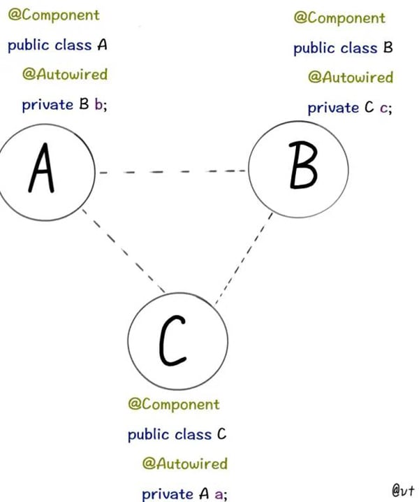

= Spring 循环依赖

循环依赖在编程中是一个常见问题（当然，这并不是最佳实践）。并且，Spring 如何解决循环依赖这个问题在面试中也经常见。下面，D瓜哥就从源码的层面深入剖析一下这个问题。

== 示例程序

先展示一下示例程序：

[{java_src_attr}]
----
package com.diguage.truman.context;

import org.apache.commons.logging.Log;
import org.apache.commons.logging.LogFactory;
import org.junit.jupiter.api.Test;
import org.springframework.beans.factory.annotation.Autowired;
import org.springframework.context.annotation.AnnotationConfigApplicationContext;
import org.springframework.context.annotation.Configuration;
import org.springframework.context.annotation.Import;
import org.springframework.context.annotation.ImportSelector;
import org.springframework.core.type.AnnotationMetadata;
import org.springframework.stereotype.Component;

/**
 * @author D瓜哥, https://www.diguage.com/
 * @since 2020-05-24 13:02
 */
public class CircularDependenceSingletonTest {
  public static final Log log = LogFactory.getLog(CircularDependenceSingletonTest.class);

  @Test
  public void test() {
    AnnotationConfigApplicationContext applicationContext
        = new AnnotationConfigApplicationContext();
    applicationContext.register(Config.class);
    applicationContext.refresh();

    log.info(applicationContext.getBean(A.class));
    log.info(applicationContext.getBean(B.class));
    log.info(applicationContext.getBean(C.class));

    log.info("-A--------");
    A a = applicationContext.getBean(A.class);
    log.info(a);
    log.info(a.b);
    log.info("-B--------");
    B b = applicationContext.getBean(B.class);
    log.info(b);
    log.info(b.c);
    log.info("-C--------");
    C c = applicationContext.getBean(C.class);
    log.info(c);
    log.info(c.a);
  }

  @Configuration
  @Import(AbcImportSelector.class)
  public static class Config {
  }

  public static class AbcImportSelector implements ImportSelector {
    @Override
    public String[] selectImports(AnnotationMetadata importingClassMetadata) {
      return new String[]{
          A.class.getName(),
          B.class.getName(),
          C.class.getName()};
    }
  }

  @Component
  public static class A {
    @Autowired
    B b;
  }

  @Component
  public static class B {
    @Autowired
    C c;
  }

  @Component
  public static class C {
    @Autowired
    A a;
  }
}
----

上述示例代码中的循环依赖情况如下：

== 源码剖析

=== 三级缓存

D瓜哥在 https://www.diguage.com/post/dive-into-spring-core-data-structure-bean-factory/#registry[深入剖析 Spring 核心数据结构：BeanFactory] 中，概要性地对 `BeanFactory` 的属性做了一一说明。
而其中的“三级缓存”属性，则是解决循环依赖问题的关键所在：

. `Map<String, Object> singletonObjects = new ConcurrentHashMap<>(256)`：Bean 名称到单例 Bean 的映射，用于存放完全初始化好的 Bean。可以理解成，这就是所谓的容器。这是一级缓存。
. `Map<String, Object> earlySingletonObjects = new HashMap<>(16)`：Bean 到“未成熟”单例 Bean 的映射。该 Bean 对象只是被创建出来，但是还没有注入依赖。在容器解决循环依赖时，用于存储中间状态。这是二级缓存。
. `Map<String, ObjectFactory<?>> singletonFactories = new HashMap<>(16)`：Bean 名称到 Bean 的 ObjectFactory 对象的映射，存放 Bean 工厂对象。在容器解决循环依赖时，用于存储中间状态。这是三级缓存。

Bean 的获取过程就类似计算机缓存的作用过程：先从一级获取，失败再从二级、三级里面获取。在 `org.springframework.beans.factory.support.DefaultSingletonBeanRegistry#getSingleton(java.lang.String, boolean)` 方法中，可以明确看到整个过程：

.`org.springframework.beans.factory.support.DefaultSingletonBeanRegistry#getSingleton(beanName, allowEarlyReference)`
[{java_src_attr}]
----
include::{beans_src_dir}/factory/support/DefaultSingletonBeanRegistry.java[tag=getSingleton-String-boolean]
----

=== Bean 创建过程

D瓜哥在 https://www.diguage.com/post/spring-bean-lifecycle-overview/[Spring Bean 生命周期概述] 中专门讨论过 Bean 的生命周期函数。Bean 的实例创建和依赖注入是分开来处理的。具体到 Spring 的内部函数调用，有可以描述成如下：

在 `org.springframework.beans.factory.support.AbstractAutowireCapableBeanFactory#doCreateBean` 方法中，能明确看到三个方法的调用过程。在这个方法上打上断点，开始调试。

=== 实例创建

.`org.springframework.beans.factory.support.AbstractAutowireCapableBeanFactory#doCreateBean`
[{java_src_attr},highlight=20..48]
----
include::{beans_src_dir}/factory/support/AbstractAutowireCapableBeanFactory.java[tag=doCreateBean]
----

关于 `createBeanInstance` 方法，已经在上面的注释中增加了响应说明，这里就不再贴代码了。

=== 依赖注入

接着上面的代码，往下看，看如何完成注入的：

.`org.springframework.beans.factory.support.AbstractAutowireCapableBeanFactory#doCreateBean`
[{java_src_attr},highlight=47..103]
----
include::{beans_src_dir}/factory/support/AbstractAutowireCapableBeanFactory.java[tag=doCreateBean]
----

==== `addSingletonFactory`

先来看看 `addSingletonFactory` 方法：

.`org.springframework.beans.factory.support.DefaultSingletonBeanRegistry#addSingletonFactory`
[{java_src_attr}]
----
include::{beans_src_dir}/factory/support/DefaultSingletonBeanRegistry.java[tag=addSingletonFactory]
----

从这里可以明显看出，代码符合我们上面注释中的描述： `singletonFactory` 变量被放入到 `singletonFactories` 变量中了。

==== `populateBean`

再来看看 `populateBean`

.`org.springframework.beans.factory.support.AbstractAutowireCapableBeanFactory#populateBean`
[{java_src_attr}]
----
include::{beans_src_dir}/factory/support/AbstractAutowireCapableBeanFactory.java[tag=populateBean]
----

在 https://www.diguage.com/post/spring-bean-lifecycle-overview/[Spring Bean 生命周期概述] 中对 Bean 的生命周期做了概要的介绍。这里就体现出来 `CommonAnnotationBeanPostProcessor` 和 `AutowiredAnnotationBeanPostProcessor` 的作用。上面我们用的是 `@Autowired` 注解。所以，这里使用 `AutowiredAnnotationBeanPostProcessor` 来处理。

[#inject-call-chain]
==== 依赖注入的调用链

查找依赖的调用链很繁琐，中间有牵涉到 Bean 创建的过程，这里只列出调用过程中的主要方法列表，需要请根据自己需要来单步调试。

完成依赖注入的调用链如下：

. `org.springframework.beans.factory.support.AbstractAutowireCapableBeanFactory#populateBean`
. `org.springframework.beans.factory.annotation.AutowiredAnnotationBeanPostProcessor#postProcessProperties`
. `org.springframework.beans.factory.annotation.InjectionMetadata#inject`
. `org.springframework.beans.factory.annotation.AutowiredAnnotationBeanPostProcessor.AutowiredFieldElement#inject`
. `org.springframework.beans.factory.support.DefaultListableBeanFactory#resolveDependency`
. `org.springframework.beans.factory.support.DefaultListableBeanFactory#doResolveDependency`
. `org.springframework.beans.factory.config.DependencyDescriptor#resolveCandidate`
. `org.springframework.beans.factory.support.AbstractBeanFactory#getBean(java.lang.String)`
. `org.springframework.beans.factory.annotation.InjectionMetadata#inject` -- 最后，还是在这里完成注入。

=== 加入容器

在 `org.springframework.beans.factory.support.DefaultSingletonBeanRegistry#getSingleton(String, ObjectFactory<?>)` 方法中，可以看到 Spring 在获得 Bean 实例后的处理过程：

.`org.springframework.beans.factory.support.DefaultSingletonBeanRegistry#getSingleton(String, ObjectFactory<?>)`
[{java_src_attr}]
----
include::{beans_src_dir}/factory/support/DefaultSingletonBeanRegistry.java[tag=getSingleton-String-ObjectFactory]
----

加入容器的操作也很简单：

.`org.springframework.beans.factory.support.DefaultSingletonBeanRegistry#addSingleton`
[{java_src_attr}]
----
include::{beans_src_dir}/factory/support/DefaultSingletonBeanRegistry.java[tag=addSingleton]
----

== 小结

这里，假设 `A → B` 和 `B → A` 两层循环依赖来说明问题

. 通过 `applicationContext.getBean(A.class)` 方法，委托给 `AbstractBeanFactory#doGetBean` 方法来尝试获取 Bean；获取不到则开始创建；
.. Bean 是调用 `instanceWrapper = createBeanInstance(beanName, mbd, args);` 方法创建出来了实例，然后又通过 `addSingletonFactory(beanName, () -> getEarlyBeanReference(beanName, mbd, bean));` 将已经创建的实例封装到一个 `ObjectFactory<?> singletonFactory` 匿名类中，放入到三级缓存中。
.. 在 `populateBean(beanName, mbd, instanceWrapper);` 方法，通过 `CommonAnnotationBeanPostProcessor` 和 `AutowiredAnnotationBeanPostProcessor` 的 `postProcessProperties` 查找依赖，完成注入。
... 查找依赖时，就会通过调用 `getBean(beanName)` 获取 Bean `B`。此时，还没有 Bean `B`，则会从这里的第二步开始执行，创建实例，封装后加入到三级缓存 `singletonFactories` 中，调用 `populateBean(beanName, mbd, instanceWrapper);` 方法，通过 `CommonAnnotationBeanPostProcessor` 和 `AutowiredAnnotationBeanPostProcessor` 的 `postProcessProperties` 查找依赖，完成注入。依赖注入的过程，请看 <<inject-call-chain>> 小节。
... 到这里，就要查找 Bean `A` 了，一二三级缓存依次来查找(`DefaultSingletonBeanRegistry#getSingleton(beanName, allowEarlyReference)`)，在三级缓存中，找到了对应的 `ObjectFactory<?> singletonFactory` 实例，然后调用 `getObject()` 方法，获得 `A` 的实例，将其加入到二级缓存中，将三级中的相关内容清理掉。从这里也可以看出，通过 `AbstractBeanFactory#doGetBean` 方法获得的 Bean 不一定是完全初始化好的 Bean，有可能是一个未完成初始化的实例对象。
... 获得 `A` 的实例后，就可以完成 Bean `B` 的初始化，调用 `DefaultSingletonBeanRegistry#addSingleton` 方法，将其加入一级缓存 `singletonObjects` 中，也就是容器中。（由于 Bean `B` 可以直接完成依赖注入，则它不会从三级缓存跳到二级缓存。最后的三级缓存在调用 `addSingleton` 方法时，直接被清理掉了。）
.. 到这里就可以获取 Bean `B` 了，然后完成 `A` 的依赖注入。
. 最后，通过调用 `DefaultSingletonBeanRegistry#addSingleton` 方法，将 Bean `A` 加入到一级缓存 `singletonObjects` 中，也就是容器中。所有的初始化工作就完成了。

需要注意的是，有两种情况，Spring 是没办法完成循环注入的：

. 构造函数注入 -- 这种要求在实例之前创建好依赖的实例，但是明显无法完成，所以不能解决循环依赖。
. `PROTOTYPE` 类型的 Bean 相互依赖 -- 刚刚看到，上面的三级缓存变量都是为 `SINGLETON` 类型的 Bean 准备的。`PROTOTYPE` 类型的 Bean 在检查到循环依赖时，就直接抛异常了。

== 参考资料

. https://juejin.im/post/6844903806757502984[spring是如何解决循环依赖的？ - 掘金^]
. https://developer.51cto.com/art/202005/615924.htm[图解Spring循环依赖，写得太好了！ - 51CTO.COM^]
. https://zhuanlan.zhihu.com/p/62382615[一文说透 Spring 循环依赖问题 - 知乎^]
