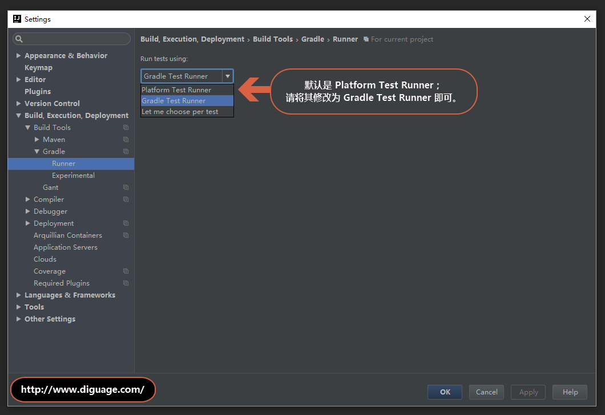

[#import-into-idea]
= 将 Spring 导入到 IntelliJ IDEA

古语有云：“工欲善其事，必先利其器！”尤其是 Java 平台，对调试的支持堪称完美，相关的工具又
是很好很强大。做 Spring 源码分析，也必须有得心应手的工具相辅相成才能事半功倍。

在 Java 开发领域中，众所周知的集成开发工具有三种：Eclipse、IDEA、Netbeans。D瓜哥在工作中，自己用过
Eclipse、IDEA。平时见到的开发工具也是以这两款为主。所以，重点介绍一下 Spring 如何导入
到这两款工具，以及如何在其中运行相关代码。本节介绍如何导入到 IDEA。

== 正常导入

在 Spring 的版本库中，也有相关文档来介绍如何导入到 IDEA。我们先按照这个文档来进行操作一
遍：

. 在终端（Windows 系统上，推荐使用 Cmder）中，进入到 Spring 源码根目录 `SPRING_HOME`。
. 预编译 `spring-oxm` 模块： `./gradlew cleanIdea :spring-oxm:compileTestJava`；在
Windows 系统上，请执行 `gradlew cleanIdea :spring-oxm:compileTestJava`。
. 导入到 IDEA 中：File → New → Project from Existing Sources... → 选中 Spring 源码
目录 → OK → import from external model → Gradle → Next → Finish，然后经过漫长的等待
后就成功导入到 IDEA 中了。
. 设计 Project 的 JDK 版本。这里分析 Spring {spring-version}，要求 JDK 的版本最低为 JDK 8。
. 官方文档上显示，需要排除 `spring-aspects`，但是根据D瓜哥自己的运行测试情况来看，没有
发现什么问题，这里就不再排除。

按照文档来操作，可以顺利导入，但是在导入过程以及运行单元测试代码时会遇到一些问题。接下来，
D瓜哥介绍一下如何解决这些问题。

== 加快 Gradle 下载速度

遇到的第一个问题：在执行 *预编译 `spring-oxm` 模块* 时，耗时特别长。只是一味地打印出一些点点，不确定是否出现什么问题。

这是由于在首次执行命令时，相当于执行 Gradle 任务，这需要下载构建工具 Gradle。由于国内特殊的网络问题，有些地方下载得很慢，有些地方甚至根本下载不了。

其实，解决这个问题也很简单，基本思路是这样的：在 `SPRING_HOME/gradle/wrapper/gradle-wrapper.properties` 文件中的 `distributionUrl` 属性指明了所需的 Gradle 下载路径。初次执行 Gradle 命令时，需要下载对应版本的 Gradle。下载中 Gradle 会存放在 `GRADLE_USER_HOME/wrapper/dists/` 的子目录下，Gradle 会在该目录下创建一个对应的目录（该目录不固定，中间有一段是一个自动生成的字符串。）。直接复制下来 `distributionUrl` 对应的下载链接，通过迅雷下载完成后，将 Gradle 压缩包复制到上述目录下，借此来“欺骗” Gradle，让其以为是自己下载完成的。终止运行的任务，然后再次执行 `./gradlew cleanIdea :spring-oxm:compileTestJava`，你会发现，很快就能完成。

== 自动手动建立 Gradle 执行任务。

上面的问题还好，即使不 Hack 一下，慢慢等待也能顺利完成。但是，把 Spring 导入到 IDEA 后，
分析 Spring 源代码，运行单元测试，进行单步调试，这是基本要求了。但是，在 IDEA 15.02以后
的版本中运行时，你就会发现，依赖的各种库都需要下载，典型的如 JUnit、Apache Commons Loggings。
实际这些库在导入时，都已经下载好了。你可以在 `USER_HOME/.gradle/caches/modules-2/files-2.1`
（可能后面的数字会有变化）目录中找到相应的库。但是，为什么 IDEA 却找不到呢？

其实，这是由于单元测试代码的运行方式导致的。在 IDEA 15.02 以后，运行单元测试时，默认使用
的是 *Platform Test Runner*。可以通过手动建立 Gradle 方式的测试运行配置来解决这个问题。
如下图：

上图中建立的整个测试类的运行配置。如果只想运行单个测试方法，只需要修改一下
*Script parameters*。将其修改为： `--tests "org.springframework.beans.factory.DefaultListableBeanFactoryTests.testUnreferencedSingletonWasInstantiated"`
即可。

新建完成后，就可以点击运行或者调试按钮来进行测试了。

== 使用 Gradle 方式来运行单元测试

上面的方式治标不治本，而且相当麻烦。更简单也更根本的解决办法是将默认 *Test Runner* 修改
为 *Gradle Test Runner*。截图如下：

经过上面的设置后，所有的单元测试都可以顺利执行了。
