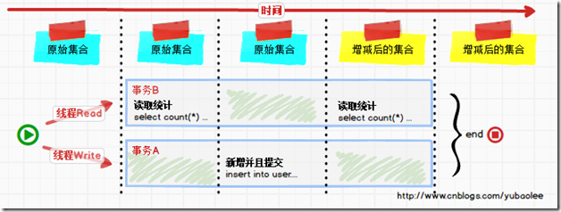
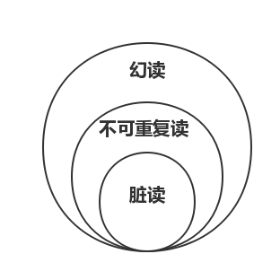
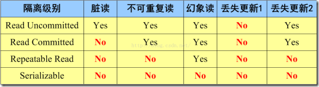

[#transaction]
= Spring 事务管理

事务是一组原子性的 SQL 查询，或者说是一个独立的工作单元。事务内的所有操作要么全部执行成功，要么全部执行失败。

== 四个基本特性

* **Atomicity（原子性）**：事务是一个不可分割的整体，事务内所有操作要么全部提交成功，要么全部失败回滚。
* **Consistency（一致性）**：事务执行前后，数据从一个状态到另一个状态必须是一致的（A向B转账，不能出现A扣了钱，B却没收到）。
* **Isolation（隔离性）**：多个并发事务之间相互隔离，不能互相干扰。或者说一个事务所做的修改在最终提交以前，对其他事务是不可见的。
* **Durablity（持久性）**：事务完成后，对数据库的更改是永久保存的，不能回滚。

== 事务隔离级别

=== Read Uncommitted(未提交读)

在 Read Uncommitted 级别，事务中的修改，即使没有提交，对其他事务也都是可见的。事务可以读取未提交的数据，这也被称为**脏读(Dirty Read)**。性能不会好太多，但是问题却一大堆，实际应用中一般很少使用。

=== Read Committed(提交读)

大多数数据库系统的默认隔离级别都是 Read Committed。Read Committed 满足前面提到的隔离性的简单定义：一个事务开始时，只能“看见”已经提交的事务所做的修改。换句话说：一个事务从开始直到提交之前，所做的任何修改对其他事务都是不可见的。有时也叫不可重复读(Nonrepeatable Read)。

=== Repeatable Read(可重复读)

Repeatable Read 解决了脏读的问题。但是还是无法解决领一个**幻读(Phantom Read)**问题。所谓幻读，指的是当某个事务在读取某个范围内的记录时，另外一个事务又在该范围内插入了新的记录，当之前的事务再次读取该范围的记录时，会产生幻行(Phantom Row)。InnoDB 和 XtraDB 存储引擎通过多版本并发控制(MVCC，Multiversion Concurrency Control)解决了幻读的问题。

=== Serializable(可串行化)

Serializable 是最高的隔离级别。它通过强制事务串行执行，避免了前面说的幻读问题。简单来说，Serializable 会在读取的每一行数据上都加锁，所以导致大量的超时和锁争用的问题。实际中，极少使用。

Repeatable Read(可重复读) 是 MySQL 默认事务隔离级别。

== 常见错误

=== Phantom Read(幻读)

B 事务读取了两次数据，在这两次的读取过程中A事务添加了数据，B 事务的这两次读取出来的集合不一样。幻读产生的流程如下：

这个流程看起来和不可重复读差不多，但幻读强调的集合的增减，而不是单独一条数据的修改。

=== NonRepeatable Read(不可重复读)

B 事务读取了两次数据，在这两次的读取过程中 A 事务修改了数据，B 事务的这两次读取出来的数据不一样。B 事务这种读取的结果，即为不可重复读（Nonrepeatable Read）。相反，“可重复读”在同一个事务中多次读取数据时，能够保证所读数据一样，也就是后续读取不能读到另一个事务已提交的更新数据。不可重复读的产生的流程如下：

image::images/non-repeatable-read-process.png[title="不可重复读处理流程", alt="不可重复读处理流程", width="95%", align="center"]

=== Dirty Read(脏读)

A 事务执行过程中，B 事务读取了A事务的修改。但是由于某些原因，A 事务可能没有完成提交，发生 RollBack 了操作，则B事务所读取的数据就会是不正确的。这个未提交数据就是脏读（Dirty Read）。

image::images/dirty-read-process.png[title="脏读处理流程", alt="脏读处理流程", width="95%", align="center"]

=== Lost Update(第一类丢失更新)

在完全未隔离事务的情况下，两个事务更新同一条数据资源，某一事务完成，另一事务异常终止，回滚造成第一个完成的更新也同时丢失 。这个问题现代关系型数据库已经不会发生。

=== Lost Update(第二类丢失更新)

不可重复读有一种特殊情况，两个事务更新同一条数据资源，后完成的事务会造成先完成的事务更新丢失。这种情况就是大名鼎鼎的第二类丢失更新。主流的数据库已经默认屏蔽了第一类丢失更新问题（即：后做的事务撤销，发生回滚造成已完成事务的更新丢失），但我们编程的时候仍需要特别注意第二类丢失更新。它产生的流程如下：

image::images/second-lost-update-process.png[title="Lost Update(第二类丢失更新)", alt="Lost Update(第二类丢失更新)", width="95%", align="center"]

=== 小结

== Spring 中的隔离级别

[cols="2,3"]
|===
|常量名称 |解释说明

|ISOLATION_DEFAULT
|默认隔离级别，使用数据库默认的事务隔离级别。另外四个与 JDBC 的隔离级别相对应。

|ISOLATION_READ_UNCOMMITTED
|最低的事务隔离级别。它允许另外一个事务可以看到这个事务未提交的数据。这种隔离级别会产生脏读，不可重复读和幻读。

|ISOLATION_READ_COMMITTED
|保证一个事务修改的数据提交后才能被另外一个事务读取。另外一个事务不能读取该事务未提交的数据。

|ISOLATION_REPEATABLE_READ
|这种事务隔离级别可以防止脏读，不可重复读。但可能出现幻读。

|ISOLATION_SERIALIZABLE
|这是花费最高代价但是最可靠的事务隔离解绑。事务被处理为顺序执行。
|===

----
Spring 的事务隔离级别在 `TransactionDefinition` 中有定义。
----

== Spring 的事务传播行为

[cols="2,3"]
|===
|常量名称 |解释说明

|PROPAGATION_REQUIRED
|支持当前事务，如果当前没有事务，就新建一个事务。这是最常见的选择,也是 Spring 默认的事务的传播。

|PROPAGATION_SUPPORTS
|支持当前事务，如果当前没有事务，就以非事务方式执行。

|PROPAGATION_MANDATORY
|支持当前事务，如果当前没有事务，就抛出异常。

|PROPAGATION_REQUIRES_NEW
|新建事务，如果当前存在事务，把当前事务挂起。新建的事务将和被挂起的事务没有任何关系，是两个独立的事务，外层事务失败回滚之后，不能回滚内层事务执行的结果内层事务失败抛出异常，外层事务捕获，也可以不处理回滚操作

|PROPAGATION_NOT_SUPPORTED
|以非事务方式执行操作，如果当前存在事务，就把当前事务挂起。

|PROPAGATION_NEVER
|以非事务方式执行，如果当前存在事务，则抛出异常。

|PROPAGATION_NESTED
|如果一个活动的事务存在，则运行在一个嵌套的事务中。如果没有活动事务，则按 `REQUIRED` 属性执行。它使用了一个单独的事务，这个事务拥有多个可以回滚的保存点。内部事务的回滚不会对外部事务造成影影响。它只对 `DataSourceTransactionManaqer` 事务管理器起效。
|===

----
Spring 的事务传播行为在 `TransactionDefinition` 中有定义。
----

分析一下 Spring 中对事务支持的管理。同时，再分析一下 Java JTA 和 Java CMT。结合二者再来分析一下 Spring 中的事务管理。

`PROPAGATION_NOT_SUPPORTED` 以非事务方式运行，如果当前存在事务，则把当前事务挂起。 

TODO 如何挂起事务？

`org.springframework.transaction.support.TransactionTemplate.execute` 中，排除 `RuntimeException | Error` 异常就回滚。那么，在 `@Transactional(rollbackFor = Throwable.class)` 中指定了回滚异常，怎么生效？

TODO: 增加创建用户并授权的 SQL 语句。

== `TransactionTemplate` 示例

[quote, Using the TransactionTemplate]
____
https://docs.spring.io/spring-framework/docs/5.3.22/reference/html/data-access.html#tx-prog-template[Data Access: Using the TransactionTemplate^]

The TransactionTemplate adopts the same approach as other Spring templates, such as the `JdbcTemplate`. It uses a callback approach (to free application code from having to do the boilerplate acquisition and release transactional resources) and results in code that is intention driven, in that your code focuses solely on what you want to do.
____

[#TransactionTemplateTest]
.TransactionTemplateTest
[{java_src_attr}]
----
include::{truman_src_dir}/tx/TransactionTemplateTest.java[]
----

在 https://stackoverflow.com/a/51839282/951836[TransactionTemplate with rollbackFor - Stack Overflow^] 中介绍了一种通过在 `try`-`catch` 中调用 `org.springframework.transaction.TransactionExecution.setRollbackOnly()` 方法来实现回滚的操作。但是，时机并不需要。可以看一下 `org.springframework.transaction.support.TransactionTemplate.execute` 的代码就明白了：

[{java_src_attr},highlight=25..30]
----
include::{tx_src_dir}/transaction/support/TransactionTemplate.java[tag=execute]
----

代码中，直接 `catch (Throwable ex)`，相信大家都了解， `Throwable` 是 Java 异常类的基类，只要 `catch` 它，任何在前面没有处理的异常，都会在这里处理，这相当于使用了 `Throwable` 做了兜底。

当然，如果有异常需要特殊处理，还是可以这样做的。多说一句，由于会先执行这个回调函数，所以，在这里捕获异常，会优先处理。这里处理完，接着往外抛异常，`TransactionTemplate` 中的异常处理机制就可以处理异常了。

[#TxTest]
.TxTest
[{java_src_attr}]
----
include::{truman_src_dir}/tx/TxTest.java[]
----

[#TxOnCloseTest]
.TxOnCloseTest
[{java_src_attr}]
----
include::{truman_src_dir}/tx/TxOnCloseTest.java[]
----

