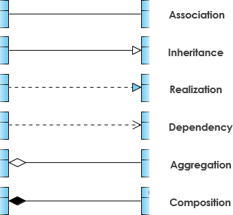

[#class-diagram]
= UML 类图

== 简介

== 要素

== 类之间的关系

UML类图几种关系的总结，泛化 = 实现 > 组合 > 聚合 > 关联 > 依赖
在UML类图中，常见的有以下几种关系: 泛化（Generalization）, 实现（Realization），关联（Association)，聚合（Aggregation），组合(Composition)，依赖(Dependency)

=== 泛化（Generalization）

泛化关系:: 是一种继承关系，表示一般与特殊的关系，它指定了子类如何特化父类的所有特征和行为。例如：老虎是动物的一种，即有老虎的特性也有动物的共性。

代码体现:: `extends` 关键字

箭头指向:: 带三角箭头的实线，箭头指向父类

[plantuml,{diagram_attr}]
....
@startuml
skinparam classFontSize 30
skinparam titleFontSize 30
title **泛化（Generalization）**

class Tiger extends Animal

class ArrayList<E> extends AbstractList

skinparam footerFontSize 20
footer ''地瓜哥''博客网 · https://www.diguage.com · 出品
@enduml
....

=== 实现（Realization）

实现关系:: 在这里插入图片描述是一种类与接口的关系，表示类是接口所有特征和行为的实现.

代码体现:: `implements` 关键字

箭头指向:: 带三角箭头的虚线，箭头指向接口

[plantuml,{diagram_attr}]
....
@startuml
skinparam classFontSize 30
skinparam titleFontSize 30
title **实现（Realization）**

class Animal implements Movable

class Thread implements Runnable

skinparam footerFontSize 20
footer ''地瓜哥''博客网 · https://www.diguage.com · 出品
@enduml
....

=== 关联（Association)

关联关系:: 是一种拥有的关系，它使一个类知道另一个类的属性和方法；如：老师与学生，丈夫与妻子关联可以是双向的，也可以是单向的。双向的关联可以有两个箭头或者没有箭头，单向的关联有一个箭头。

代码体现:: 成员变量

箭头指向:: 带普通箭头的实心线，指向被拥有者

[plantuml,{diagram_attr}]
....
@startuml
skinparam classFontSize 30
skinparam titleFontSize 30
title **关联（Association)**

class Teacher {
    - students: Student
}

class Student

Teacher -right- Student

skinparam footerFontSize 20
footer ''地瓜哥''博客网 · https://www.diguage.com · 出品
@enduml
....

老师与学生是双向关联，老师有多名学生，学生也可能有多名老师。但学生与某课程间的关系为单向关联，一名学生可能要上多门课程，课程是个抽象的东西他不拥有学生。

=== 聚合（Aggregation）

聚合关系:: 是整体与部分的关系，且部分可以离开整体而单独存在。如车和轮胎是整体和部分的关系，轮胎离开车仍然可以存在。
聚合关系是关联关系的一种，是强的关联关系；关联和聚合在语法上无法区分，必须考察具体的逻辑关系。

代码体现:: 成员变量

箭头指向:: 带空心菱形的实心线，菱形指向整体

[plantuml,{diagram_attr}]
....
@startuml
skinparam classFontSize 30
skinparam titleFontSize 30
title **聚合（Aggregation）**

class Car {
    - engine: Engine
    - tire: Tire
}

Car o-left- Engine

Car o-right- Tire

skinparam footerFontSize 20
footer ''地瓜哥''博客网 · https://www.diguage.com · 出品
@enduml
....

小技巧：空心菱形表示聚合，好聚好散，所以生命周期可以不同。

=== 组合(Composition)

组合关系:: 是整体与部分的关系，但部分不能离开整体而单独存在。如公司和部门是整体和部分的关系，没有公司就不存在部门。
+
组合关系是关联关系的一种，是比聚合关系还要强的关系，它要求普通的聚合关系中代表整体的对象负责代表部分的对象的生命周期。

代码体现:: 成员变量

箭头指向:: 带实心菱形的实线，菱形指向整体

[plantuml,{diagram_attr}]
....
@startuml
skinparam classFontSize 30
skinparam titleFontSize 30
title **组合(Composition)**

class Dog {
    - head: Head
    - tail: Tail
    - ear： Ear
}

Dog *-left- Head

Dog "1" *-right- "1" Tail

Dog "1" *-- "2" Ear

skinparam footerFontSize 20
footer ''地瓜哥''博客网 · https://www.diguage.com · 出品
@enduml
....

== 参考资料

. https://zhuanlan.zhihu.com/p/93289356[UML:类图关系总结 - 知乎^]
. http://jiagoushi.pro/book/export/html/1213[【软件设计】UML中关联，聚合和组合区别^]
. https://www.visual-paradigm.com/guide/uml-unified-modeling-language/uml-class-diagram-tutorial/[UML Class Diagram Tutorial^]